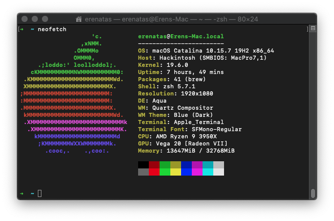

# Hackintosh X570I Aorus Pro Wifi | 3950X | Radeon VII



Based on Opencore 0.6.3
## Specs:
- **Motherboard:** Gigabyte X570I Aorus Pro Wifi ITX
- **CPU:** AMD Ryzen 3950X
- **GPU:** AMD Radeon VII
- **RAM:** G.Skill DDR4 Ripjaws 2x16GB 3600Mhz [F4-3600C16D-32GVKC]

## Status:
### Not working / Not tested
- Wifi (BT works)
- Sleep
- Mac Pro Memory Notification still appears (even though the kext is there)
- Big Sur Support (It should work)

## Workarounds:
### Docker
Made Docker work with Virtualbox, headless docker-machine VM, and adding docker binaries to `$PATH`.
## Discord
For Discord, create the following file with 

`$ nano ~/Library/LaunchAgents/environment.plist`:
```
<?xml version="1.0" encoding="UTF-8"?>

<!DOCTYPE plist PUBLIC "-//Apple//DTD PLIST 1.0//EN" "http://www.apple.com/DTDs/PropertyList-1.0.dtd">

<plist version="1.0">
<dict>
 <key>Label</key>
 <string>my.startup</string>
 <key>ProgramArguments</key>
 <array>
 <string>sh</string>
 <string>-c</string>
 <string>launchctl setenv MKL_DEBUG_CPU_TYPE 5</string>

 </array>
 <key>RunAtLoad</key>
 <true/>
</dict>
</plist>
```

and run on terminal:
```
$ launchctl load ~/Library/LaunchAgents/environment.plist
$ launchctl start ~/Library/LaunchAgents/environment.plist
```

This should do.